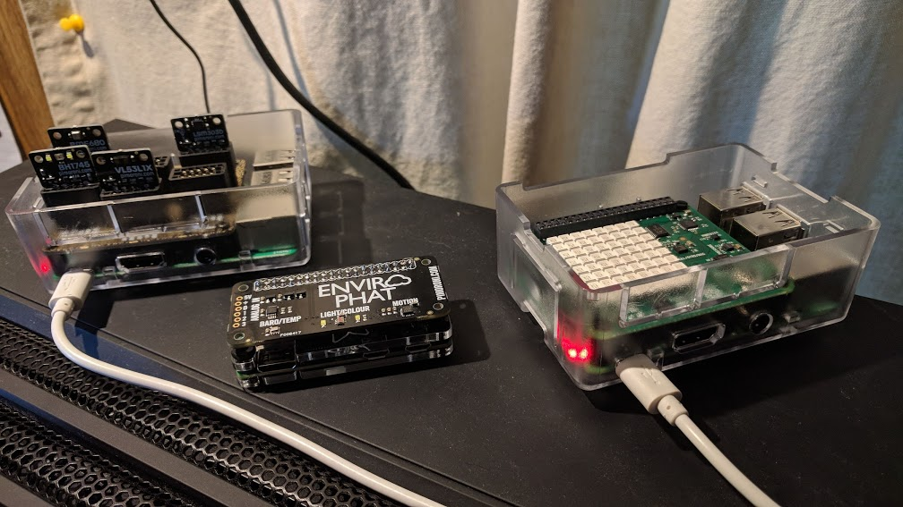

# Kootnet Sensors - RPi Sensor Recording Software
This program is used to record sensor readings on a Raspberry Pi to an SQLite3 database.  
Add one or more of the 14+ supported sensors to record and view readings of your choice.  

Sensor types include heat, pressure, altitude, humidity, distance, gas, particulate matter 1/2.5/10, light, 
color, ultra violet, acceleration, electromagnetic fields and angular velocity (gyroscope).

Features include a Web Portal to graph, view live readings, generate reports, upload data to 3rd party weather services and more!  

[Project Website](http://kootenay-networks.com/?page_id=170)  
[KootNet Sensors - Control Center](https://github.com/chad-ermacora/sensor-control-center) - GUI Companion App (Depreciated)

Installing, Updating & Removing
-------------------------
**Supported Operating Systems**: Raspbian & Ubuntu  
**Note**: *Kootnet Sensors should work on Debian and other Debian based systems that support Python 3.5 or higher.* 

**Supported Hardware for Sensor Recording**  
**[Raspberry Pi](https://www.raspberrypi.org/products/)**  
*System Boards*: Zero W, 3x, 4x and Probably Previous RPi's but they are untested  
*Combo Sensors*: Sense HAT

**[Pimoroni](https://shop.pimoroni.com/)**  
*Displays*: 11x7 LED Matrix, 1.12" Mono OLED (128x128, white/black), 0.96" SPI Colour LCD (160x80)  
*Temperature*: *MCP9600  
*Color/Light*: AS7262, BH1745, VEML6075  
*Combo Sensors*: Enviro+, EnviroPHAT, BME680, BMP280, LTR-559  
*Volatile Organic Compounds*: *SGP30  
*Particulate Matter*: PMS5003  
*Distance*: VL53L1X  
*Accelerometer/Magnetometer/Gyroscope*: ICM20948, LSM303D, *MSA301

**Note**: *Sensors names starting with a * are untested sensors.*

If you have a Debian desktop environment, you can simply 
[download this file](http://kootenay-networks.com/installers/KootnetSensors.deb) and double click to install.  
After the install is done, open https://localhost:10065 on the Raspberry Pi itself to configure and use the sensor.  
If you are installing from the command line, run the following command in a terminal.  

```
wget -O KootnetSensors.deb http://kootenay-networks.com/installers/KootnetSensors.deb && sudo apt-get update && sudo apt-get -y install ./KootnetSensors.deb
```

To uninstall Kootnet Sensors, run the following command in a terminal.  
**Note**: *You can also find kootnet-sensors in your Operating System's package manager.*
```
sudo apt-get remove kootnet-sensors
```

Controlling the Sensor
-------------------------

**Kootnet Sensors** has a built in HTTPS server (Web Portal) to monitor, manage and operate the Sensor.  
There is also a 'Sensor Control' section in the Web Portal for managing one or more remote sensors.  
Assuming the sensor's IP is 192.168.10.11, you can access the sensor at https://192.168.10.11:10065 
from any device with a web browser on the same network. 

**Default Web Portal Login**  
*User*: Kootnet  
*Password*: sensors

**Recommended**: *Change the default Web Portal username and password after install.*  
**Note**: *Find shortcuts to edit configurations and access the Web Portal in the operating systems main menu.*  

Configurations can also be changed using the terminal by running the following command.
```
sudo /home/kootnet_data/env/bin/python /opt/kootnet-sensors/start_cli_edit_config.py
```

Sensor System Service
----------

'KootnetSensors' is the GNU/Linux systemd service that automatically starts Kootnet Sensors. 

**The following terminal command disables and stops KootnetSensors**
```
sudo systemctl disable KootnetSensors && sudo systemctl stop KootnetSensors
```
**The following terminal command enables and starts KootnetSensors**
```
sudo systemctl enable KootnetSensors && sudo systemctl start KootnetSensors
```
Example Raspberry Pi Sensor Units
---------------------

