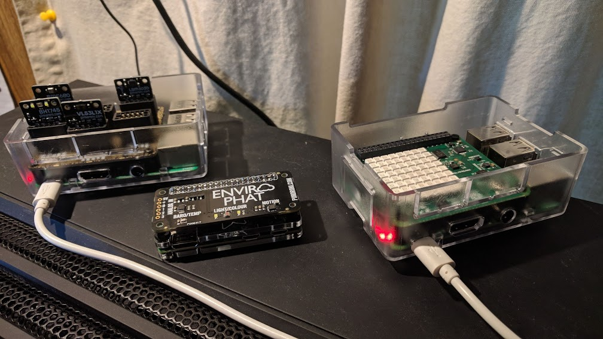

# KootNet Sensors - Raspberry Pi Sensor Software
Python3 programs for the Raspberry Pi that record sensors to SQLite3 Databases.  It also contains a TCP/IP network service for remotely interacting with the sensor.

Install instructions can be found below.  If followed, the install script will download all necessary files, install 4 services and reboot the sensor.  Once the sensor boots back up, it will start recording sensor data as per settings applied during setup.

[Project Website](http://kootenay-networks.com/?page_id=170)

[KootNet Sensors Downloads and Instructions](http://kootenay-networks.com/?page_id=236)

[PC Control Center](https://github.com/chad-ermacora/sensor-control-center)


Controlling the Sensor
-------------------------

**KootNet Sensors - PC Control Center** was created to interact with up to 16 sensors at a time, over a TCP/IP network.

See [PC Control Center](https://github.com/chad-ermacora/sensor-control-center) for more information.


Services
----------

The following are Linux systemd services that automatically start with the system and restart if terminated. 

**SensorHTTP**
>Lighttpd instance for downloading databases.

**SensorCommands**
>Network "Server" to receive commands from the PC Control Center program.

**SensorInterval**
>Records Interval Sensors to a SQLite3 Database at a set Interval in Seconds (Default 5 Min).

**SensorTrigger**
>Continually monitors Sensors for a exceeded "Trigger Variance", at which point it records all Trigger readings to a SQLite3 database.


##### Run the following command(s) in a sensors terminal or SSH session to stop the service and prevent it from starting.

**SensorHTTP**
```
sudo systemctl disable SensorHTTP && sudo systemctl stop SensorHTTP
```

**SensorCommands**
```
sudo systemctl disable SensorCommands && sudo systemctl stop SensorCommands
```

**SensorInterval**
```
sudo systemctl disable SensorInterval && sudo systemctl stop SensorInterval
```

**SensorTrigger**
```
sudo systemctl disable SensorTrigger && sudo systemctl stop SensorTrigger
```

Sensor Hardware Units
---------------------

